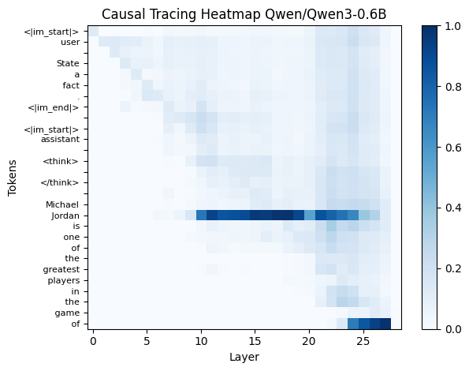
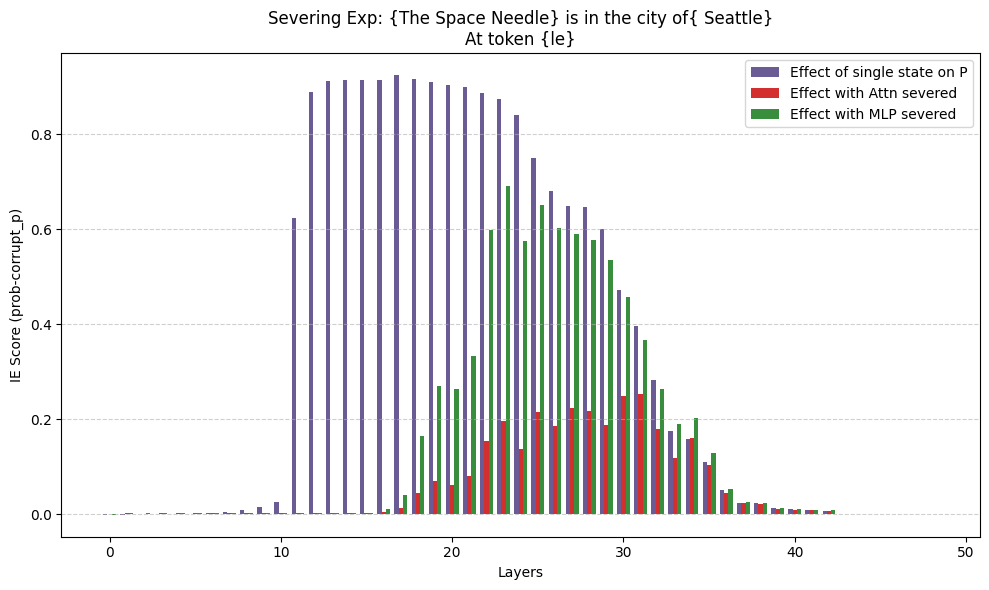

# Causal-Tracing-Demo

A ComfyUI reproduction of Causal Tracing, introduced in the paper [“Locating and Editing Factual Associations in GPT” (Meng et al., 2023)](https://arxiv.org/abs/2202.05262).

[Download Workflow](./workflow/workflow.json)

## Requirements

-   [ComfyUI](https://github.com/comfyanonymous/ComfyUI): The node-based Pythonic system.

-   [ComfyUI-Notebook](https://github.com/liusida/ComfyUI-Notebook): A custom node that implements the Notebook Cell.

## Example Results

The model [Qwen3-0.6B](https://huggingface.co/Qwen/Qwen3-0.6B) with the prompt _"Michael Jordan is one of the greatest players in the game of"_:

(Tip: you can drag the heatmap image directly to ComfyUI to load the workflow.)

## What is Causal Tracing

According to the paper [“Locating and Editing Factual Associations in GPT” (Meng et al., 2023)](https://arxiv.org/abs/2202.05262):

Causal Tracing is a method to find which parts of a language model recall a specific fact.
The process involves:

1. Running the model normally with the correct input, and again with a corrupted version (where the subject is set to noise).

2. Then, selectively restoring individual hidden activations to their clean state.

3. If restoring a specific activation fixes the output probability, that activation is causally responsible for recalling the fact.

## My Interpretation

Since the subject is replaced with noise in the corrupted version, the activations that restore the correct output probability can be thought of as carrying information about the subject — not necessarily the entire factual association (i.e., the relationship between the subject and the object).

I see Causal Tracing as analogous to [angiography](https://en.wikipedia.org/wiki/Angiography) in medicine: it reveals how the “information flow” of the subject moves through the model’s activations during a normal run.

The early site reflects the aggregation of information about the subject toward the last token of the phrase. (e.g. "Michael Jordan" -> "Jordan", or "The Space Needle" -> "le", right before the early site.)

I'm still trying to understand the MLP-recall aspect of the early site. Specifically, I don't understand why the paper severs the MLP addition all the way through to the final layer, rather than only at the early site itself.

## Updated: Attn/MLP Severing Experiment

[Download Workflow](./workflow/Severing-Exp.json)

## Differences from the Original Paper

This implementation differs from the original paper in several ways:

1. **Corruption Method**: Instead of adding Gaussian noise of 3 times its std deviation, we added noise of std=0.1. (a mistake)

2. **Indirect Effect(IE)**: Instead of using IE ($P_{final} - P_{corrupted}$), we simply use $P_{final}$.

## Observations on 1000 Factual Prompts

I noticed that the information content of the subject's last token affects how severing attention modules impacts the model's predictions.

When the subject's last token contains substantial information—for example, " Vermont" in "The University of Vermont"—the model can make accurate predictions even when attention is severed, because the last token alone carries enough information. This pattern may explain why Figure 3(c) shows that severing attention has minimal effect on average across many prompts.

However, when the subject's last token contains little information—for example, " More" in "Yesterday Once More"—the model relies on attention to aggregate information from earlier tokens. In these cases, severing MLP and severing attention have similar effects: neither shows a clear advantage, and there's no pattern where attention severing rises before MLP severing.

Another interesting case occurs when asking which state "Missouri University of Science and Technology" is located in. The model doesn't rely heavily on the last subject token in this case, since it can extract the answer from the first subject token ("Missouri").
